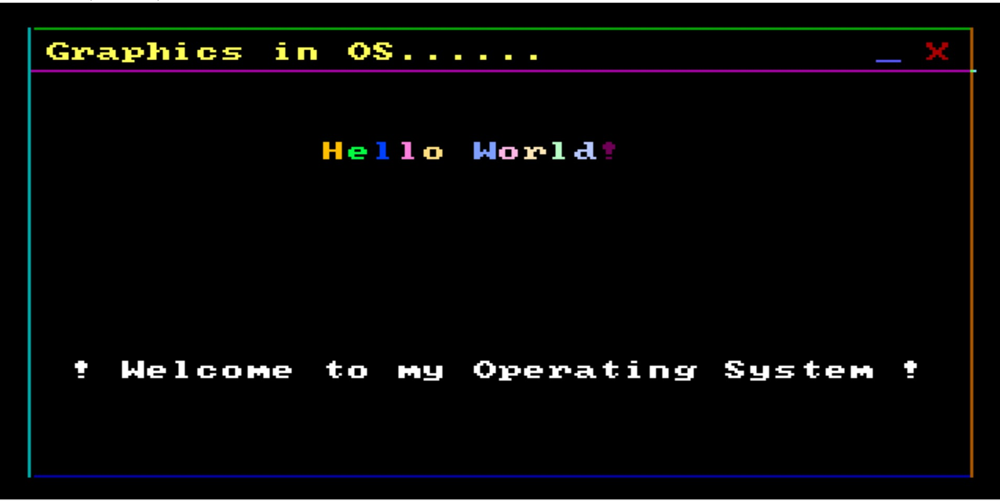

# **Strawhat Kernel**
<link rel="stylesheet" type="text/css" media="all" href="./assets/style.css" />

  

## **Table of Contents**

- [AdminPortal](#AdminPortal)
  - [Table of Contents](#table-of-contents)
  - [Important Links](#important-links)
  - [About](#about)
  - [Screenshots](#screenshots)
 
  - [Contributors](#contributors)

## **Important Links**

[Project Report](https://drive.google.com/file/d/1Y-K3aG7Q6OJ7khoZs8s60r2qNHuuPqnY/view?usp=sharing)  

[Project Running Video](https://drive.google.com/file/d/1-6jaGEKnDW9f1QGs3bcGMEdgwa8TWPPL/view?usp=sharing)

[OS ISO FILES](https://drive.google.com/drive/folders/1ZI5ShpJEG0fyAiibeJ9aFaF81WHHfY3r?usp=sharing)

## **About**

In this project we have implemented a kernel from scratch using assembly and C language. Kernel is the core component of any operating system. We have implemented kernel components like bootloader, x86 calculator, tic tac toe and ping pong game. 
The first part of operating system is the Bootloader.
Bootloader is a piece of program that runs before any operating system is running. It is used to boot other operating systems, usually each operating system has a set of Bootloaders specific for it.
Bootloaders usually contain several ways to boot the OS kernel and also contain commands for debugging and/or modifying the kernel environment.

## **Screenshots**

## Contributors

[Nitish Kumar](https://github.com/Nitish9711)

[Naveen Kumar](https://github.com/NaveenKumar519)

